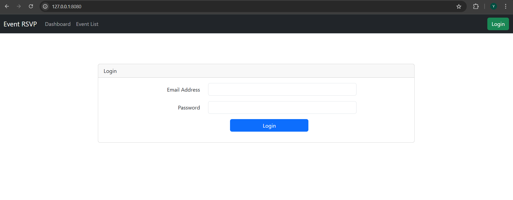
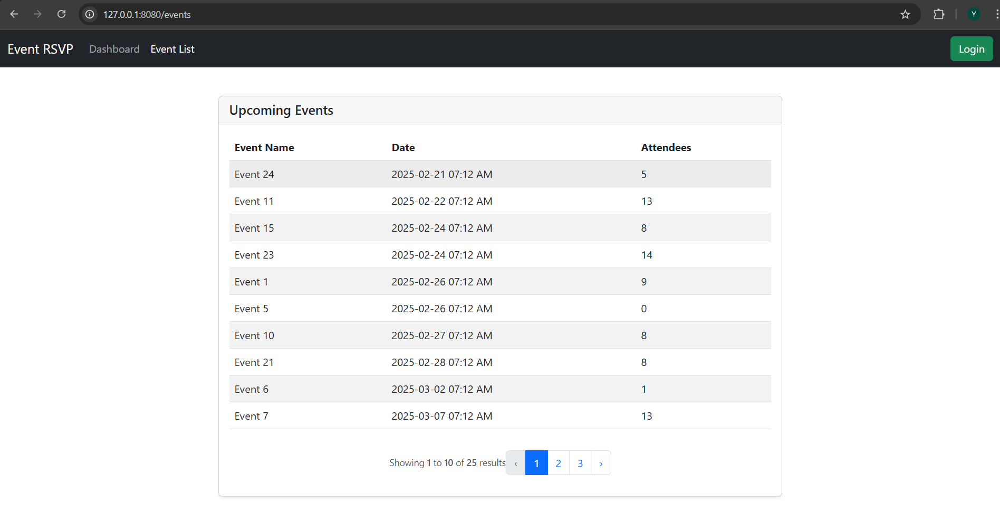
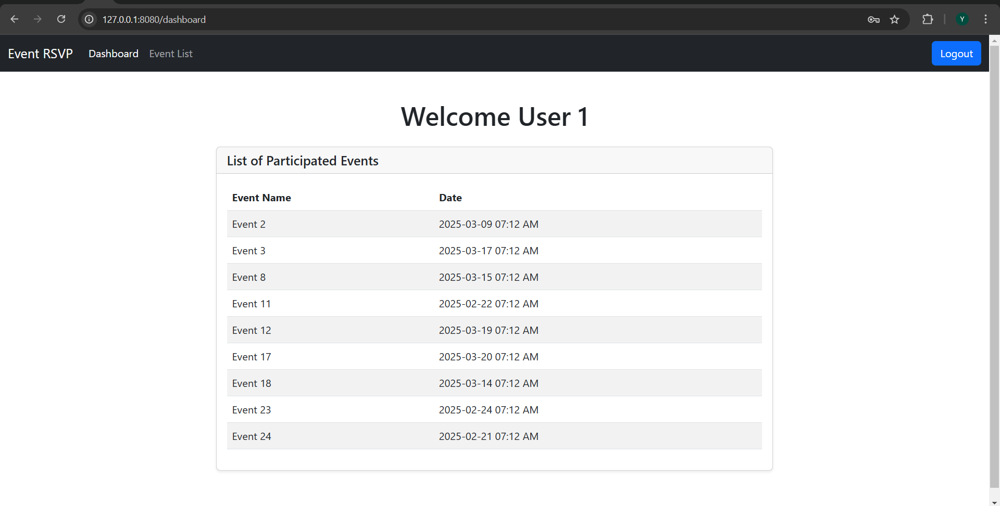
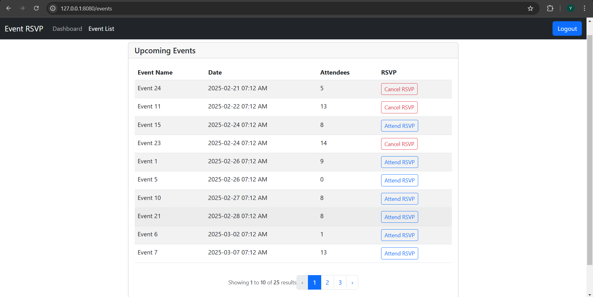

# Event RSVP

A simple Laravel 10 application for managing event RSVPs, allowing users to register for events and manage their attendance.

## 🚀 Project Setup

Follow these steps to set up the project on your local machine:

### 1️⃣ Clone the Repository
```sh
git clone <repository-url>
cd event-rsvp
```

### 2️⃣ Install Dependencies
```sh
composer update
```

### 3️⃣ Configure the `.env` File
- Copy `.env.example` to `.env`
```sh
cp .env.example .env
```
- Update the database credentials in `.env`:
```env
DB_CONNECTION=mysql
DB_HOST=127.0.0.1
DB_PORT=3306
DB_DATABASE=eventrsvp
DB_USERNAME=root
DB_PASSWORD=
```

### 4️⃣ Run Migrations and Seed Data

#### 🏗️ Migrations Created:
- `users`
- `events`
- `event_rsvps`

#### 🌱 Seeders Created:
- `UsersSeeder`
- `EventsSeeder`
- `EventRsvpSeeder` (for attendees count)

Run the following command to create tables and seed initial data:
```sh
php artisan migrate --seed
```

### 5️⃣ Serve the Application
```sh
php artisan serve
```
The application will be available at `http://127.0.0.1:8000/`

## 📌 Features
- Guest users can check events
- User authentication
- RSVP system for logged-in users to attend/withdraw from events

## 🛠️ Technologies Used
- Laravel 10
- MySQL
- Livewire (for interactive UI components)
- Bootstrap CSS (for styling)

## 🌐 Routes

### 1️⃣ Login Page
- **URL:** `http://127.0.0.1:8000/`
- Allows users to log in to access RSVP functionality.


### 2️⃣ Guest Users: View Events
- **URL:** `http://127.0.0.1:8000/events`
- Guests can browse available events without logging in.


### 3️⃣ Logged-in User Dashboard
- **URL:** `http://127.0.0.1:8000/dashboard`
- Displays a list of events the user has participated in.


### 4️⃣ Logged-in User: Manage RSVPs
- **URL:** `http://127.0.0.1:8000/events`
- Users can view events and choose to attend or withdraw RSVP.
